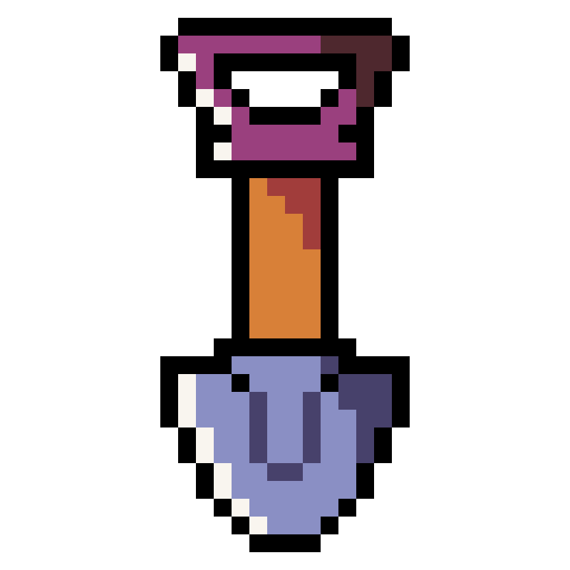
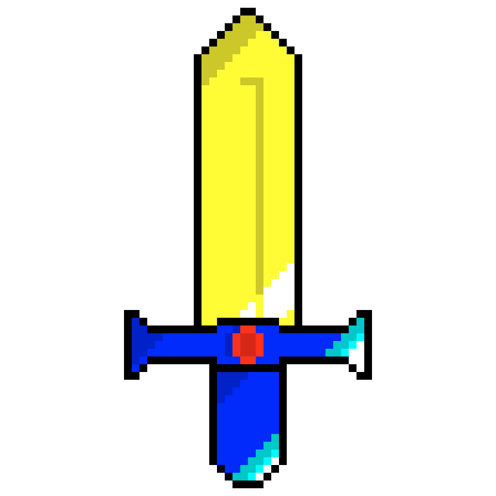
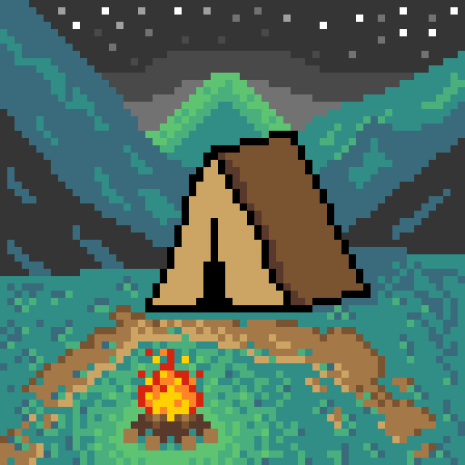
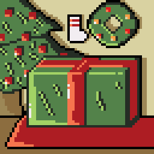
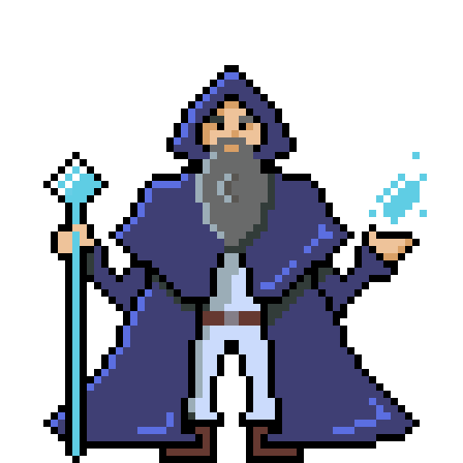
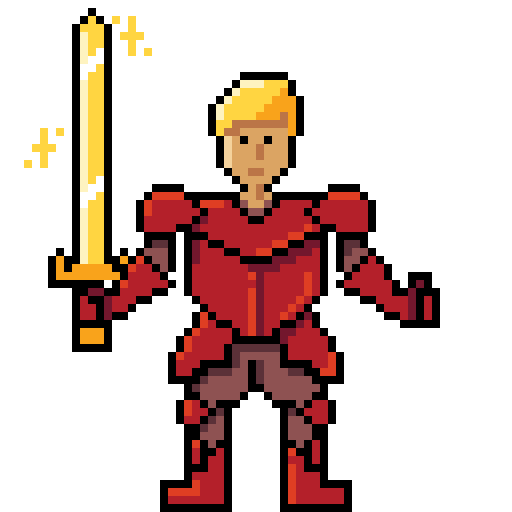
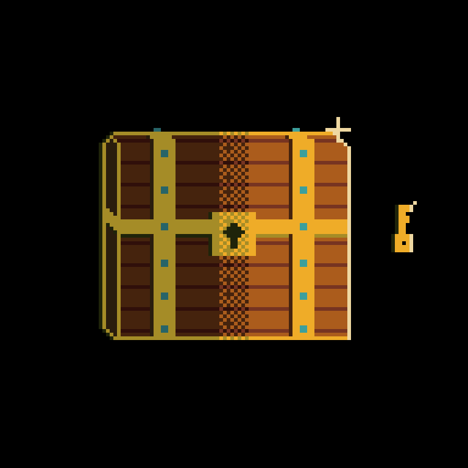

- :wave: Hi, I’m Maori
- I have a undergraduate physics degree :mortar_board:
- I’m currently learning javaScript, HTML, CSS and REACT in a FullStack program called DevinHouse
- I’m looking for a first job/trainee opportunity 

- I’m interested in programming, software & game dev and pixel art :space_invader:

  <a href="https://github.com/maorif">
  
  

  

  
  

 Some of my pixel art :)

 

  
  
  
  
  
  
  
 

  
<!---
maorif/maorif is a ✨ special ✨ repository because its `README.md` (this file) appears on your GitHub profile.
You can click the Preview link to take a look at your changes.
--->
